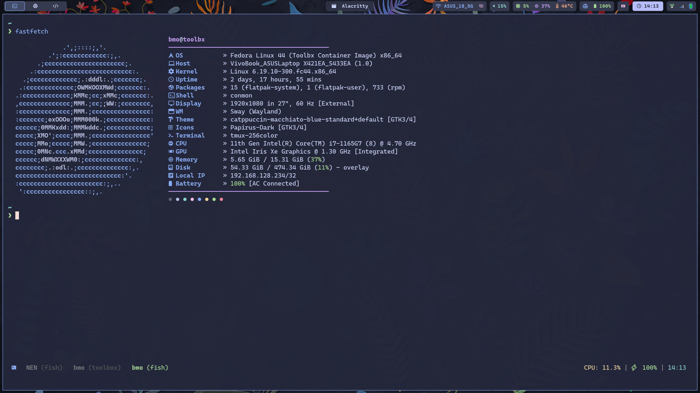

# dotfiles — My Personal Dotfiles & System Setup

A robust, clean, and modular configuration repository for my development environments. The repository is designed for **Fedora Sway Atomic** but structured to support various Linux distributions (Fedora Workstation, Arch Linux, Debian/Ubuntu) and macOS.



## Main Features
*   **Window Manager:** Sway with highly customized layouts, bar configurations, and notifications.
*   **Terminal & Shell:** Alacritty (Catppuccin Macchiato) + Fish shell + Tmux + Starship prompt.
*   **System Info:** Fastfetch with a custom Catppuccin Macchiato theme.
*   **Editor:** Helix + Zed with clean setups.
*   **Navigation & Search:** Zoxide (smarter `cd`), FZF (fuzzy finder), Ripgrep (better `grep`), and Eza (better `ls`).
*   **Secrets Security:** Credentials are kept secure using `pass` (Standard Unix Password Manager) and are never checked into version control.

---

## Quick Bootstrap (Super Install)

To set up everything on a fresh system, clone this repository and run the super-installer:

```bash
git clone https://github.com/credimusin/dotfiles.git ~/.dotfiles
cd ~/.dotfiles
chmod +x install.sh
./install.sh
```

### What the installer does:
1.  **System Package Installation:**
    *   **Fedora Atomic:** Automatically layers required packages (`alacritty`, `bat`, `btop`, `chromium`, `eza`, `fastfetch`, `fd-find`, `fish`, `fzf`, `helix`, `jq`, `pass`, `ripgrep`, `swappy`, `tldr`, `tmux`, `wtype`, `zoxide`) using `rpm-ostree`.
    *   **Fedora Workstation / RHEL:** Uses `dnf`.
    *   **Arch Linux:** Uses `pacman`.
    *   **Debian/Ubuntu:** Uses `apt-get`.
    *   **macOS:** Uses Homebrew.
2.  **Flatpak GUI Applications:** Installs flatpaks (`mpv`, `Obsidian`, `LocalSend`, `cmus`). (Excludes heavy torrent clients or media players from automated installs, but retains their configs).
3.  **Symlink Creation:** Creates robust symlinks from `~/.dotfiles` to `~/.config` and `~/.local/bin`, keeping backup files of any pre-existing configurations as `.bak.<timestamp>`.
4.  **Fish Shell Activation:** Promptly offers to switch your default shell to Fish.

---

## Security & Credentials (`pass`)

No passwords or tokens are stored in plain text inside this repository. For example, the `vpn-control.sh` script retrieves the VPN password securely from `pass`.

### Setup `pass` on a new system:
1.  **Generate a GPG Key** (if you don't have one):
    ```bash
    gpg --full-generate-key
    ```
2.  **Initialize the Password Store**:
    ```bash
    pass init <your-gpg-key-id>
    ```
3.  **Add the VPN password**:
    ```bash
    pass insert vpn/qwesta
    ```
    Enter your VPN password when prompted. The `vpn-control.sh` script will now automatically pull the password from `pass show vpn/qwesta`.

---

## Repository Structure
```text
dotfiles/
├── .config/             # Application configurations
│   ├── alacritty/       # Alacritty terminal emulator settings
│   ├── fastfetch/       # System information fetch configuration
│   ├── fish/            # Fish shell configs & functions
│   ├── helix/           # Helix editor configuration
│   ├── tmux/            # Tmux session manager settings
│   ├── zed/             # Zed editor configuration
│   └── sway/            # Sway window manager and custom layouts
├── .local/
│   └── bin/             # Custom helper scripts & utilities
├── Pictures/            # Wallpapers and system screenshots
├── .bashrc              # Fallback bash shell configuration
├── .gitconfig           # Shared git configuration
└── install.sh           # Main bootstrap setup script
```
